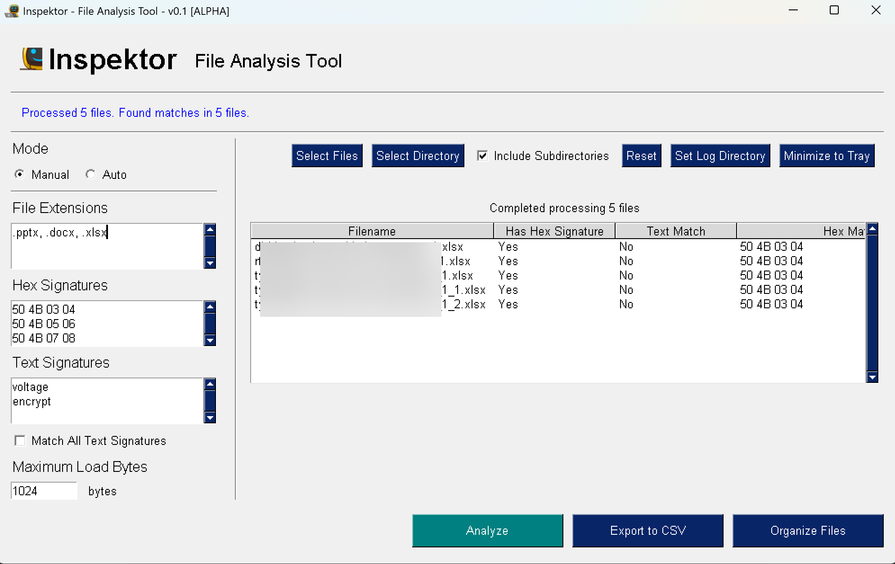

# Inspektor - File Signature Checker

Inspektor is a cross-platform Python desktop application / cli / Windows service that helps you analyze files by checking their binary content for known signatures.


## Features

- Load multiple files for inspection
- Check files against customizable hex signatures (e.g., "50 4B 03 04")
- Check files against customizable text signatures (e.g., "encrypted", "voltage")
- Toggle between matching any or all text signatures
- Efficient parallel processing using multiprocessing
- User-friendly desktop interface with results table

## Installation

1. Clone this repository:
```
git clone https://github.com/yourusername/inspektor.git
cd inspektor
```

2. Create a virtual environment (optional but recommended):
```
python -m venv .venv
```

3. Activate the virtual environment:
   - Windows:
   ```
   .venv\Scripts\activate
   ```
   - macOS/Linux:
   ```
   source .venv/bin/activate
   ```

4. Install the required dependencies:
```
pip install -r requirements.txt
```

## Usage

### GUI Mode

1. Run the application in GUI mode:
```
python inspektor.py
```

### CLI Mode

The application can also be run in command-line mode, which is useful for automated monitoring or running as a service:

```
.\inspektor.exe --mode=auto --scan_dir="F:\test" --hex_signatures="504B0304,504B0506,4D5A,504" --text_signatures="instrument,apple" --match_all --file_extensions=".docx,.xlsx,.pdf" --max_load_bytes="1024" --move_files_path="F:\matches" --log_dir="F:\logs"
```

#### CLI Arguments

- `--mode`: Operation mode (currently only 'auto' is supported)
- `--scan_dir`: Directory to scan and monitor (required)
- `--file_extensions`: Comma-separated list of file extensions to scan (e.g., ".txt,.pdf,.docx"). Leave empty, use "*.*", or ".*" to scan all files
- `--hex_signatures`: Comma-separated list of hex signatures
- `--text_signatures`: Comma-separated list of text signatures
- `--match_all`: Whether all text signatures must match
- `--max_load_bytes`: Maximum number of bytes to load from each file (default: 1024)
- `--move_files_path`: Custom directory path where matched files will be moved (default: "matches" subfolder in scan directory)
- `--log_dir`: Directory to store log files (default: application directory)

#### Example: Monitor a directory for files with specific signatures

```
python inspektor.py --mode auto --scan_dir "C:\Documents\incoming" --hex_signatures "50 4B 03 04" --text_signatures "encrypted,password" --file_extensions ".docx,.xlsx,.pdf"
```

This command will:
1. Monitor the "C:\Documents\incoming" directory
2. Check for files with .docx, .xlsx, or .pdf extensions
3. Look for the ZIP file signature (50 4B 03 04) and text containing "encrypted" or "password"
4. Move matching files to a "matches" subdirectory within the scan directory

#### Example: Using a custom directory for matched files

```
python inspektor.py --mode auto --scan_dir "C:\Documents\incoming" --hex_signatures "50 4B 03 04" --text_signatures "encrypted,password" --move_files_path "D:\MatchedFiles"
```

This command will:
1. Monitor the "C:\Documents\incoming" directory
2. Look for the ZIP file signature (50 4B 03 04) and text containing "encrypted" or "password"
3. Move matching files to the "D:\MatchedFiles" directory instead of the default "matches" subdirectory

### Installing as a Windows Service with NSSM

You can run Inspektor as a Windows service using NSSM (Non-Sucking Service Manager):

1. Download NSSM from [nssm.cc](https://nssm.cc/download)

2. Extract the appropriate executable (nssm.exe) for your system architecture (32-bit or 64-bit)

3. Open Command Prompt as Administrator and navigate to the directory containing nssm.exe

4. Install the service with the following command:

```
nssm.exe install InspektorService
Note for Powershell: .\nssm.exe install InspektorService 
```

5. In the NSSM service installer dialog:
   - Path: Enter the full path to your Python executable or the standalone Inspektor.exe
   - Startup directory: Enter the directory containing inspektor.py or the executable
   - Arguments: If using Python, add `inspektor.py` followed by your CLI arguments

   Example for Python:
   ```
   Path: C:\Python39\python.exe
   Startup directory: C:\path\to\inspektor
   Arguments: inspektor.py --mode auto --scan_dir "C:\Documents\incoming" --hex_signatures "50 4B 03 04" --text_signatures "encrypted,password" --move_files_path "D:\MatchedFiles"
   ```

   Example for standalone executable:
   ```
   Path: C:\path\to\inspektor\dist\inspektor.exe
   Startup directory: C:\path\to\inspektor\dist
   Arguments: --mode=auto --scan_dir="F:\test" --hex_signatures="504B0304,504B0506,4D5A,504" --text_signatures="instrument,apple" --match_all --file_extensions=".docx,.xlsx,.pdf" --max_load_bytes="1024" --move_files_path="F:\matches" --log_dir="F:\logs"
   ```

6. Configure other service settings as needed (service name, description, startup type, etc.)

7. Click "Install service"

#### Command Line Installation with NSSM

You can also install the service directly from the command line:

```
nssm.exe install InspektorService "C:\path\to\inspektor\dist\inspektor.exe" "--mode auto --scan_dir \"C:\Documents\incoming\" --hex_signatures \"50 4B 03 04\" --text_signatures \"encrypted,password\" --move_files_path \"D:\MatchedFiles\""
```

To set the service description:
```
nssm.exe set InspektorService Description "Inspektor file monitoring service"
```

To set the service to start automatically:
```
nssm.exe set InspektorService Start SERVICE_AUTO_START
```

To start the service:
```
nssm.exe start InspektorService
```

To remove the service:
```
nssm.exe remove InspektorService confirm
```

## Building a Standalone Executable

You can create a standalone executable file that doesn't require Python to be installed:

1. Make sure you have installed the requirements:
```
pip install -r requirements.txt
```

2. Run the build script:
```
python build_exe.py
```

3. Once the build process completes, you'll find the executable in the `dist` folder.

4. You can distribute the executable file (`inspektor.exe` on Windows) to users who don't have Python installed.

5. When running the executable in CLI mode, the application will automatically show console output, allowing you to see logs and status messages directly in the command prompt or terminal window:
   ```
   inspektor.exe --mode auto --scan_dir "C:\path\to\monitor" --hex_signatures "50 4B 03 04" --text_signatures "encrypted"
   ```

## Using the Application

1. Use the sidebar to:
   - Enter hex signatures in the "Hex Signatures" multiline box (one per line)
   - Enter text signatures in the "Text Signatures" multiline box (one per line)
   - Check "Match All Text Signatures" if all text signatures must be found (otherwise, any match is sufficient)
   - Click "Select Files" to choose files for inspection
   - Click "Analyze Files" to process the selected files

2. View the results in the main table:
   - Filename: Name of the analyzed file
   - Has Hex Signature: Whether any hex signatures were found
   - Text Match: Whether text signatures were found according to the match criteria
   - Hex Matches: List of matched hex signatures
   - Text Matches: List of matched text signatures


## How It Works

1. Files are checked for hex signatures (binary patterns)
2. Files are checked for text signatures (text patterns)
3. Results show which files match the specified signatures

## Default Signatures [info](https://en.wikipedia.org/wiki/List_of_file_signatures)

The application comes with default signatures for ZIP file formats and related formats:
- 50 4B 03 04 (ZIP)
- 50 4B 05 06 (Empty archive)
- 50 4B 07 08 (Spanned archive)

These signatures can help identify various file formats based on the ZIP format, such as:
- EPUB
- JAR
- ODF
- OOXML
- DOCX
- XLSX
- and many more

## License

[GNU Lesser General Public License v3.0 (LGPL-3.0)](LICENSE)
